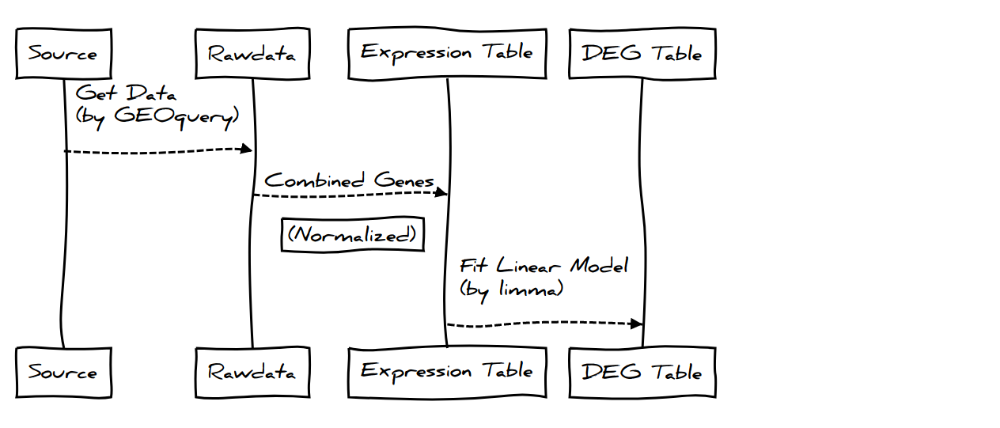
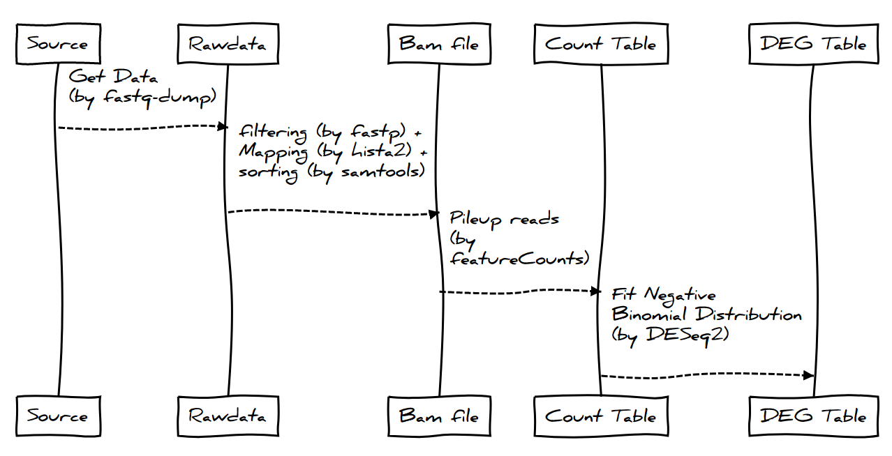
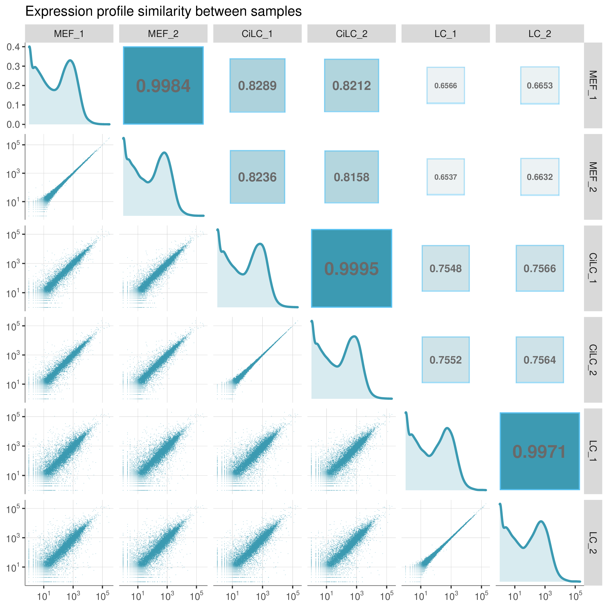
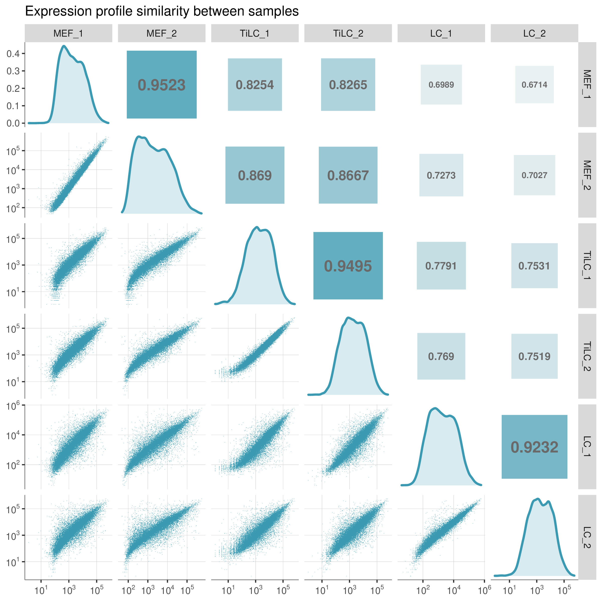
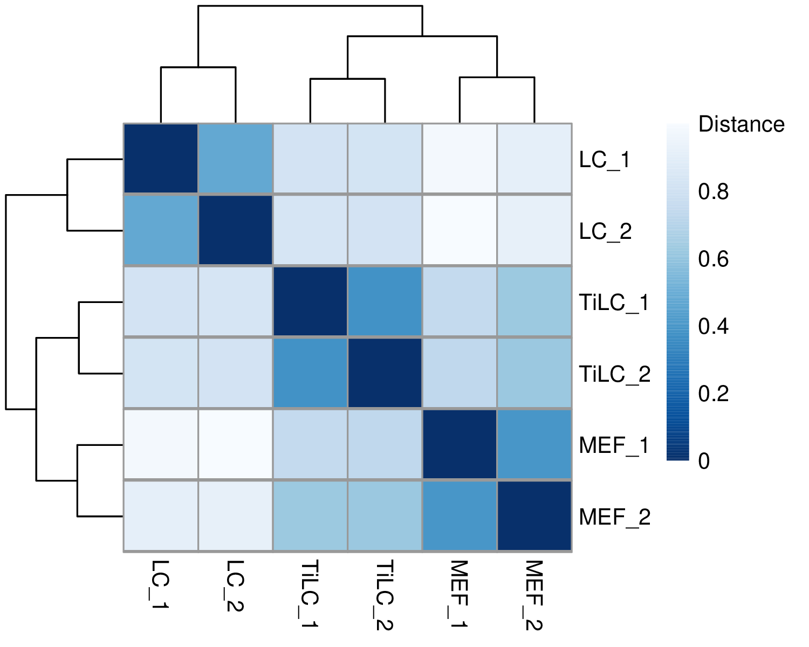

# Induction of Leydig Cells by Two Approaches

## 样品分组及命名 (Samples and Data)

- **Data**

| Experiment | Date | Data source                                                            |
| ---------- | ---- | ---------------------------------------------------------------------- |
| TFs        | 2017 | [Array](https://www.ncbi.nlm.nih.gov/geo/query/acc.cgi?acc=GSE87020)   |
| Chemicals  | 2020 | [RNASeq](https://www.ncbi.nlm.nih.gov/geo/query/acc.cgi?acc=GSE145797) |

## 数据获取及预处理（Data Preprocessing）

- Array 数据分析流程

- RNASeq 数据分析流程

## 表达量测定（Expression Quantification）

以 TFs 诱导组为例：

	

> 文件 `fig_seq_distance.pdf`

Chemicals 诱导组的结果类似：[^1]

	
	&nbsp;&nbsp;&nbsp;&nbsp;
	

---

> Footnote

- pdf 中是矢量图，符合发表的格式，可以用 AI/Inkscape 编辑文字。
- 这个文件中图片为 png 格式，清晰度为 300 DPI, 可以直接复制使用。包括那些缩小的图。

[^1]: 参考 xxxxxx
