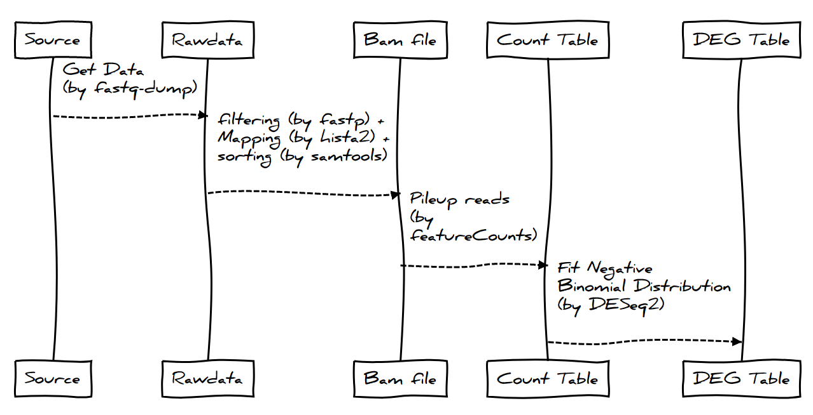
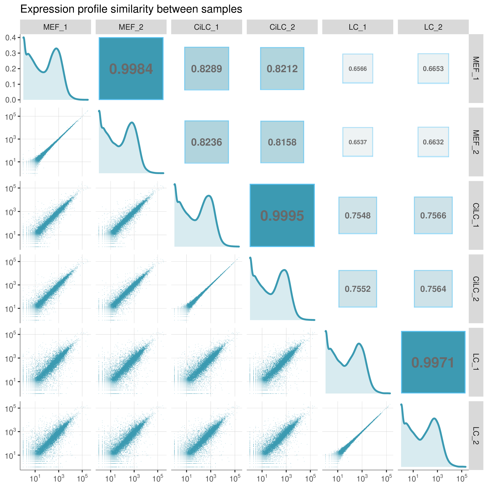
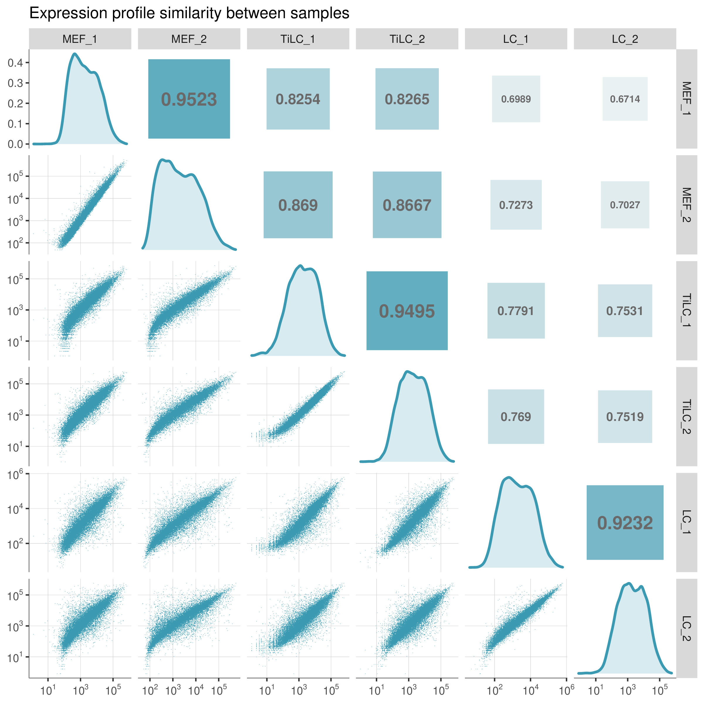
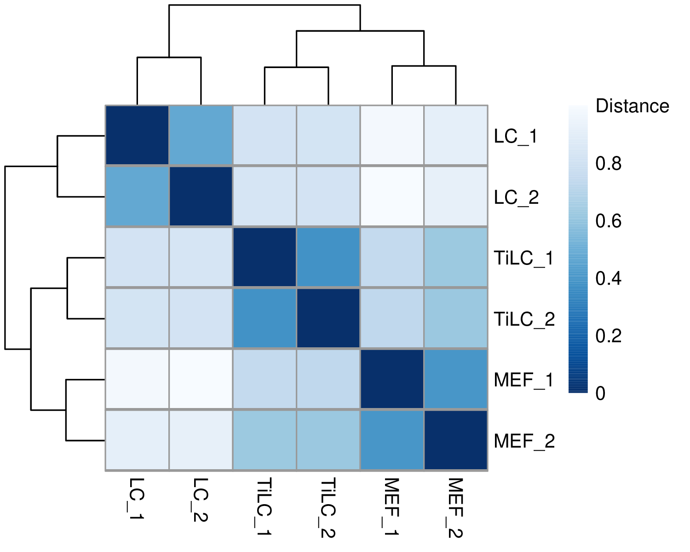

good job

# Analysis

## 样品分组及命名 (Samples and Data)

- **Data**

| Experiment | Date | Data source                               |
| ---------- | ---- | ----------------------------------------- |
| TFs        | 2017 | [Array](https://www.ncbi.nlm.nih.gov/geo) |
| Chemicals  | 2020 | [RNASeq](https://www.ncbi.nlm.nih.gov)    |

## 数据获取及预处理（Data Preprocessing）

#### Figure: this text is ignored {#figure2}

{#sealA width=50%}

{width=30%}

{width=100%}

- Array 数据分析流程

```{.python}
print('test')
```

```python
print('test')
```

```{.graphviz caption="This is an image, created by **Graphviz**'s dot."}
digraph finite_state_machine {
	rankdir=LR;
	size="8,5"
	node [shape = doublecircle]; LR_0 LR_3 LR_4 LR_8;
	node [shape = circle];
	LR_0 -> LR_2 [ label = "SS(B)" ];
	LR_0 -> LR_1 [ label = "SS(S)" ];
	LR_1 -> LR_3 [ label = "S($end)" ];
	LR_2 -> LR_6 [ label = "SS(b)" ];
	LR_2 -> LR_5 [ label = "SS(a)" ];
	LR_2 -> LR_4 [ label = "S(A)" ];
	LR_5 -> LR_7 [ label = "S(b)" ];
	LR_5 -> LR_5 [ label = "S(a)" ];
	LR_6 -> LR_6 [ label = "S(b)" ];
	LR_6 -> LR_5 [ label = "S(a)" ];
	LR_7 -> LR_8 [ label = "S(b)" ];
	LR_7 -> LR_5 [ label = "S(a)" ];
	LR_8 -> LR_6 [ label = "S(b)" ];
	LR_8 -> LR_5 [ label = "S(a)" ];
}
```


- RNASeq 数据分析流程



# Results

## 表达量测定（Expression Quantification）

以 TFs 诱导组为例：

<figure align="center">
	
    <figcaption>
    Lorem Ipsum is simply
    </figcaption>
</figure>

> 文件 `fig_seq_distance.pdf`

> This is a inline formula: $e^{\pi \times i} = -1$

This is a block formula:

$$e^{\pi \times i} = -1$$

Chemicals 诱导组的结果类似：[^1]

<p align="left">
<figure>
	
    <figcaption>
    Lorem Ipsum is simply
    </figcaption>
</figure>
<figure>
	
    <figcaption>
    Lorem Ipsum is simply dummy text of the printing and typesetting industry. Lorem Ipsum has been the industry's standard dummy text ever since the 1500s, when an unknown printer took a galley of type and scrambled it to make a type specimen book. It has survived not only five centuries, but also the leap into electronic typesetting, remaining essentially unchanged. It was popularised in the 1960s with the release of Letraset sheets containing Lorem Ipsum passages, and more recently with desktop publishing software like Aldus PageMaker including versions of Lorem Ipsum.
    </figcaption>
</figure>
</p>

[^1]: 参考 xxxxxx

# Highlight

test
